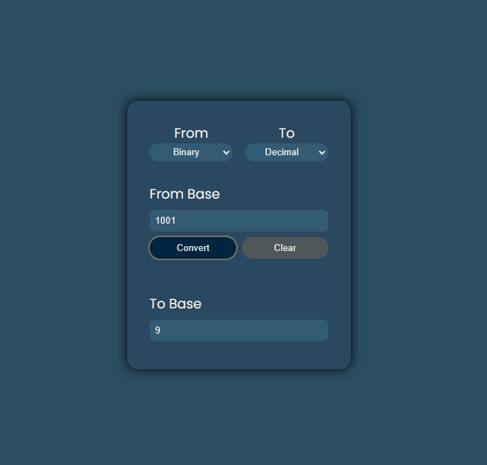

# System Base Converter

## Introduction

System Base Converter is a web application developed in React that allows users to convert numbers from one base system to another. The application supports binary, octal, decimal, and hexadecimal values. It provides a user-friendly interface where users can easily select the base system from which they want to convert a specific number and the base system to which they want the number to be converted.

## Table of Contents

- [Link](#Link)
- [Built with](#built-with)
- [App preview](#app-preview) 

### Link

- URL to Website: (https://system-base-converter.netlify.app/)

### Built with

- HTML
- CSS
- Typescript
- React

### App preview

